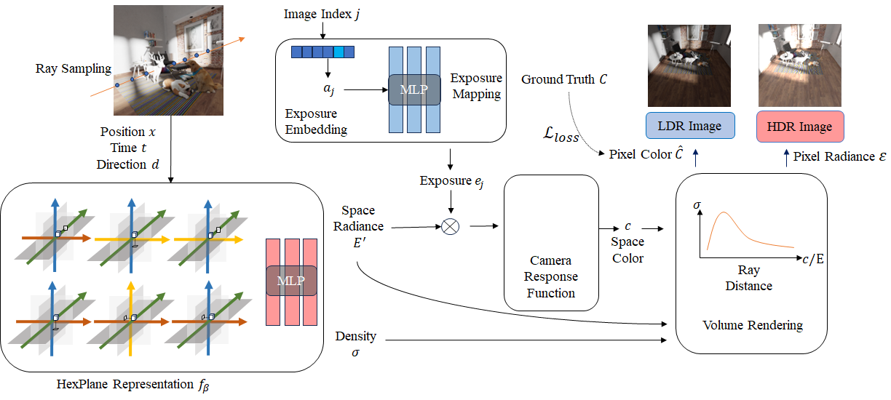

# HDR-HexPlane: Fast High Dynamic Range Radiance Fields for Dynamic Scenes

## 3DV 2024
### [Project Page](https://guanjunwu.github.io/HDR-HexPlane/)| [Data](https://drive.google.com/drive/folders/19eTjvgw98_hYodCMegHHg5PjhNUgFVNO?usp=sharing)

[Guanjun Wu](https://guanjunwu.github.io/) <sup>1*</sup>, [Taoran Yi](https://github.com/taoranyi) <sup>2*</sup>,
[Jiemin Fang](https://jaminfong.cn/) <sup>2‡</sup>, [Wenyu Liu](http://eic.hust.edu.cn/professor/liuwenyu/) <sup>2</sup>, [Xinggang Wang](https://xwcv.github.io) <sup>2‡✉</sup>

<sup>1 </sup>School of CS, HUST &emsp; <sup>2 </sup>School of EIC, HUST &emsp;

<sup>\*</sup> Equal Contributions. <sup>$\ddagger$</sup> Project Lead. <sup>✉</sup> Corresponding Author.

---

We propose a dynamic HDR NeRF framework, named as HDR-HexPlane, which can learn 3D scenes from dynamic 2D images captured with various exposures. We further construct a dataset containing multiple dynamic scenes captured with diverse exposures for evaluation.



# Environment Setup

```
# create conda environment
conda create --name hexplane python=3.9

# pip install 
pip install -r requirements.txt
```

# Data Preparation

Please download all the data from the [link](https://drive.google.com/drive/folders/19eTjvgw98_hYodCMegHHg5PjhNUgFVNO?usp=sharing):

Make the dataset format like: `dataset/lego`.

Please change the "datadir" in config based on the locations of downloaded datasets.

# Reconstruction

```
python main.py config=config/dnerf_slim_airplane.yaml
```

We provide several config files under [config](config/) folder for different datasets and models.

# Evaluation

With `render_test=True`, `render_path=True`, results at test viewpoint are automatically evaluated and validation viewpoints are generated after reconstruction.

```
python main.py config=config/dnerf_slim_airplane.yaml systems.ckpt="checkpoint/path" render_only=True
```

# Citation

Some insights about neural voxel grids and dynamic scenes reconstruction originate from [TiNeuVox](https://github.com/hustvl/TiNeuVox) and [hexplane](https://github.com/Caoang327/HexPlane). If you find this repository/work helpful in your research, welcome to cite these papers and give a ⭐.
```
@article{wu2024hdrhexplane,
  title={Fast High Dynamic Range Radiance Fields for Dynamic Scenes},
  author={Wu, Guanjun and Yi, Taoran and Fang, Jiemin and Liu, Wenyu and Wang, Xinggang},
  booktitle={3DV},
  year={2024}
}
```

# Acknowledgement

Our code is hugely influenced by [hexplane](https://github.com/Caoang327/HexPlane) and many other projects. We would like to acknowledge them for making great code openly available for us to use. **All the datasets are provided for academic studies only.**
